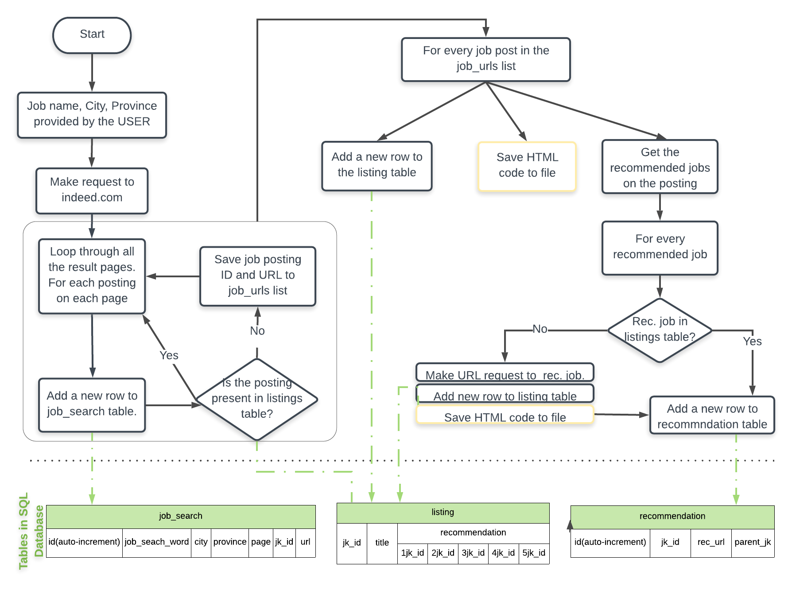

# Indeed_Scraper
This program is scraping job postings from indeed.com, it saves the postings locally in .html files and it stores the meta data associated with each posting in a database located in a .sqlite file.

##### Steps that the program is performing:
1. Loop through all the job titles in the list.
2. For every job title, loop through all the cities in the list.
3. For each job and city, perform a search on indeed.com.
4. Go though all the results pages, extract the ID of each posting and perform the following 2 tasks:
    - Store the meta data about the posting in the job_search SQL table. The <b>job_search table</b> stores the following information:
<table>
  <tr>
    <th style="text-align:center"> job_search SQL Table </th>
  </tr>
  <tr>
    <td>
      <table>
        <tr>
          <th style="text-align:center"> id </th>
          <th style="text-align:center"> job_seach_word </th>
          <th style="text-align:center"> city </th>
          <th style="text-align:center"> province </th>
          <th style="text-align:center"> page </th>
          <th style="text-align:center"> jk_id </th>
          <th style="text-align:center"> url</th>
        </tr>
        <tr>
          <td style="text-align:center"> auto-increment ID </td>
          <td style="text-align:center"> the word used to perform the search on indeed.com </td>
          <td style="text-align:center"> the city name used to perform the search on indeed.com </td>
          <td style="text-align:center"> the province name used to perform the search on indeed.com</td>
          <td style="text-align:center"> the number of the results page that the job posting was found on</td>
          <td style="text-align:center"> the job ID associated with each posting given by indeed.com</td>
          <td style="text-align:center"> the URL of the individual job posting.</td>
        </tr>
      </table>
    </td>
  </tr>
</table>
    - Check to see if the jk_id for each listing is present in the listings SQL table. If it is not, store the jk_id and the url of the posting in the job_urls list. 
5. Go though all the jk_ids and the urls in job_url list. These job listings have not been yet scraped. For each job posting perform the following task:
    - Access the URL of the job posting.
    - Save the HTML code in a .html file locally on the computer. 
    - Get the jk_id and url for up to 5 recommended jobs showed on this listing. Add a new row to the <b>listing table</b> that includes the following information.
<table>
  <tr>
    <th style="text-align:center"> listing SQL Table </th>
  </tr>
  <tr>
    <td>
      <table>
        <tr>
          <th style="text-align:center"> id </th>
          <th style="text-align:center"> jk_id </th>
          <th style="text-align:center"> title </th>
          <th style="text-align:center"> recommendation 1_jk </th>
          <th style="text-align:center"> recommendation 2_jk </th>
          <th style="text-align:center"> recommendation 3_jk </th>
          <th style="text-align:center"> recommendation 4_jk </th>
          <th style="text-align:center"> recommendation 5_jk </th>
        </tr>
        <tr>
          <td style="text-align:center"> auto-increment ID </td>
          <td style="text-align:center"> the job_id of this specific posting found on indeed.com </td>
          <td style="text-align:center"> the title of the job posting </td>
          <td style="text-align:center"> the jk_id of the first recommended job found on this listing.</td>
          <td style="text-align:center"> the jk_id of the second recommended job found on this listing.</td>
          <td style="text-align:center"> the jk_id of the third recommended job found on this listing.</td>
          <td style="text-align:center"> the jk_id of the forth recommended job found on this listing.</td>
          <td style="text-align:center"> the jk_id of the fifth recommended job found on this listing.</td>
        </tr>
      </table>
    </td>
  </tr>
</table>
    - For each recommended job found of the job posting, perform the following two tasks:
        - Add a new line to the <b>recommendation table</b> that includes the following information:
<table>
  <tr>
    <th style="text-align:center"> recommendation SQL Table </th>
  </tr>
  <tr>
    <td>
      <table>
        <tr>
          <th style="text-align:center"> id </th>
          <th style="text-align:center"> jk_id </th>
          <th style="text-align:center"> url </th>
          <th style="text-align:center"> parent_jk </th>
        </tr>
        <tr>
          <td style="text-align:center"> auto-increment ID </td>
          <td style="text-align:center"> the jk_id of the recommendation posting </td>
          <td style="text-align:center"> the url of the recommentation posting </td>
          <td style="text-align:center"> the jk_id of the job listing where the recommended job was found</td>
        </tr>
      </table>
    </td>
  </tr>
</table>
        - Check to see if the recommended job is in the listing table. If it is not, make a request and access the url of the recommended job posting, save the HTML code in a .html file on the computer and add a new line to the listings table. 

